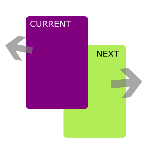
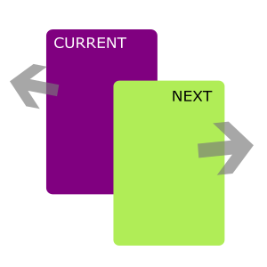
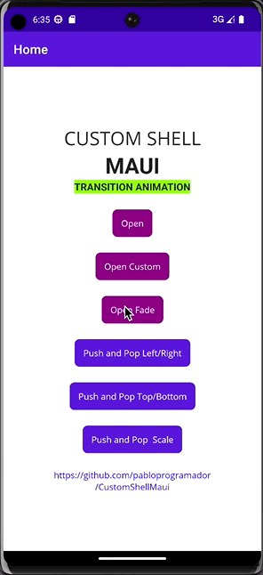
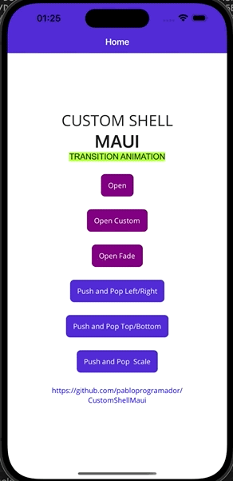
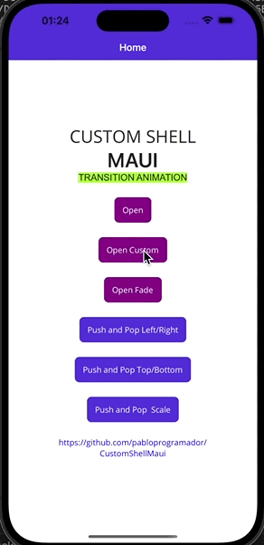
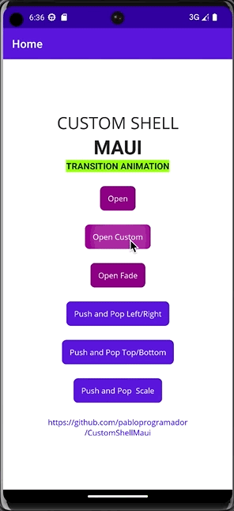

# Custom Shell Maui
Custom Shell Navigation with custom animation transition.
A .NET MAUI library for easily customizable animations of transitions of pages.

Thanks github.com/jsuarezruiz for inspiring this project.
[Xamarin.Forms Page Transitions](https://github.com/jsuarezruiz/xamarin-forms-page-transitions)

The library consists of one NuGet packages:

[](https://www.nuget.org/packages/CustomShellMaui/)

[Sample](https://github.com/pabloprogramador/CustomShellMaui/tree/main/CustomShellMaui.Sample)

To use, simply install the package and add use to your builder:
```javascript
var builder = MauiApp.CreateBuilder();
    builder
      .UseMauiApp<App>()
      .UseCustomShellMaui()
```
Animations are divided into Root, Push, Pop.

Configure animations for the current page and next page

|||
|-|-|
|Current as above|Next as above|

Also configure which page will be on top of the other with the above option

You can use the default animations:
```javascript
Shell.Current.CustomShellMaui(new Models.Transitions
    {
        Root = new Models.TransitionRoot
        {
            CurrentPage = Enum.TransitionType.FadeOut //is Above by default 
        },
        Push = new Models.Transition
        {
            CurrentPage = Enum.TransitionType.LeftOut,
            NextPage = Enum.TransitionType.RightIn //is Above
        },
        Pop = new Models.Transition
        {
            CurrentPage = Enum.TransitionType.RightOut, //is Above
            NextPage = Enum.TransitionType.LeftIn
        },
    });
Shell.Current.GoToAsync(nameof(Pages.New1));
```
|||||

Or you can customize the advanced transitions however you want:
```javascript
Shell.Current.CustomShellMaui(new Models.Transitions
        {
            Root = new Models.TransitionRoot
            {
                AbovePage = Enum.PageType.NextPage, //is forced Above
#if ANDROID
                NextPageAndroid = Resource.Animation.custom_in, //[xml android animation](https://developer.android.com/guide/fragments/animate)
                DurationAndroid = 1500,
#elif IOS
                NextPageIos = new Platforms.iOS.ConfigIos()
                {
                    OpacityStart = 0,
                    OpacityEnd = 1,
                    RotationStart = .1,
                    RotationEnd = 0,
                    ScaleStart = 1.5,
                    ScaleEnd = 1,
                    XStart = 1,
                    XEnd = 0,
                    YStart = .3,
                    YEnd = 0,
                    Duration = 1.5
                },
#endif
                CurrentPage = Enum.TransitionType.None,
            }
        });
Shell.Current.GoToAsync("//" + nameof(Pages.New2));
//Root navigation i.e. with two slashes (“//“)
```
|||

***Android advanced animation must be done using Resource xml, see more in the Android documentation
https://developer.android.com/guide/fragments/animate
